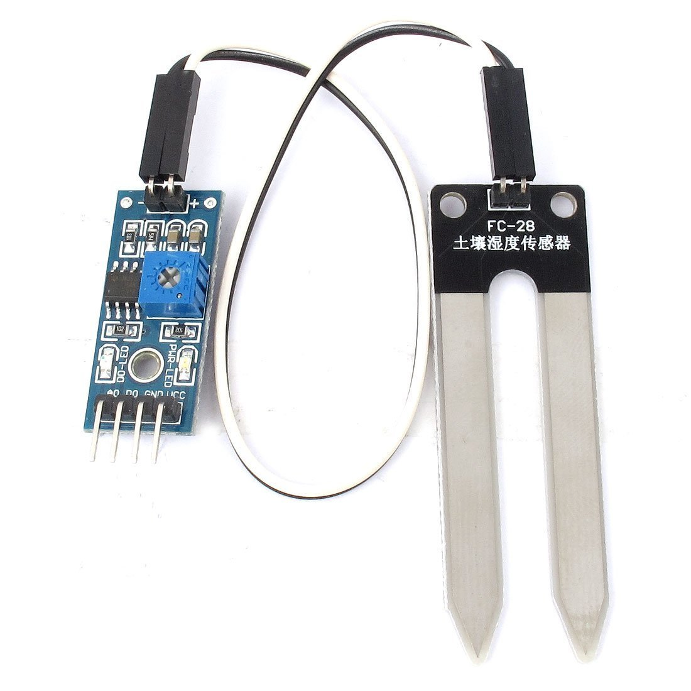

# A simple automated plant watering system using the node_MCU arduino board. 

#### Requirements
1. waterproof water pump capable of running from 3/5v (£5)
2. NodeMCU (£4)
3. A watering container (I used a 5L pvc container)
4. Some plants to water
5. Some plastic tubing for the pump
6. Soil hydrometer(s) ($1 each)

and finally a WiFi connection (optional but useful)

#### Methodology
Provided we already know how to flash and run the NodeMCU controller (find the blink example online if you dont), we wish to test the range of our humidity sensors. 
We can do this by connecting the nodeMCU to a computer and viewing the results in our serial window. 

If like me you have opted for the rather inexpensive T-28 unit, this has 4 available pins: A power, a ground , a digital and an analog. As I am interested in plotting the difference of soil humidity over time, I shall opt to connect the analog connector to the a0 pin on the nodemcu, the vcc pin to a 3v pin, and the ground to the corresponding ground. 



To test the ranges of our sensor we can run the following code and have the pins situated in and out of a glass of water. Since these units have a finite lifetime, and work by measuring the resistance of the soil, it is not in our interest to have them permanently on. It is for this reason we shall

```arduino
void setup()
{  
  Serial.begin(9600);
}
void loop()
{
  Serial.print(analogRead(A0));
  delay(10000);
}

```

Since these units have a finite lifetime, and work by measuring the resistance of the soil, it is not in our interest to have them permanently on. It is for this reason we shall add an on-off timer as well as the measurement delay above. To do this we can move our vcc connector to the D6 pin. This is a digital pin and can be used as an on off power switch. 


```arduino
void setup()
{  
  Serial.begin(9600);
}

void loop()
{
  pinMode(D6, OUTPUT); 
  digitalWrite(D6, HIGH);#allow 3v to pass through the D6 pin. 
  delay(10000); #allow 1 second warmup time
  Serial.print(analogRead(A0));
  pinMode(D6, INPUT); #turn the pin off by making it an input
  
  delay(40000);
}

```

Now to test when our plants need watering we shall need to monitor their moisture content over a period of days. As it is not practical to keep this connected and running through our computer the whole time, we can make use of the Blynk app and the onboard Wifi capabilities of the ESP chip. 

First we need to download the blink library for arduino, and install it on our phone. Then we want to record the authentication code sent in the registration email. 


```arduino
#include <BlynkSimpleEsp8266.h>

// You should get Auth Token in the Blynk App.
// Go to the Project Settings (nut icon).
char auth[] = "6bf5947800164d45b266fc1b1c861ade";
char ssid[] = "your wifi name";
char pass[] = "wifi password";

void setup()
{  
  Serial.begin(9600);
  Blynk.begin(auth, ssid, pass);
}

void loop()
{
  pinMode(D6, OUTPUT); 
  digitalWrite(D6, HIGH);#allow 3v to pass through the D6 pin. 
  delay(10000); #allow 1 second warmup time
  
  Blynk.virtualWrite(0,analogRead(A0)); # instead of writing to a serial window, we can write to the blynk app on a virtual pin
  
  pinMode(D6, INPUT); #turn the pin off by making it an input
  
  delay(40000);
}

```

In blynk if you select a history graph (900 energy units) It will be able to periodically record your nodemcu readings. You can then manually experiment with how the readings change as you water your plants. 


Now we know where our happy plant threshold lies we can add a watering supply. 

## Adding a water supply
*** Firstly - and most importantly, do NOT under any circumstances place your water supply above your hose exit point. All this does is start siphoning your supply until you have run out of water (its basic physics really) ***


## Finally if you really want, you can either connect multiple nodemcus to the same app, or publish your own version for your friends and family to be able to view it 

 
